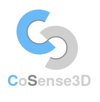

<p align="center">
  
</p>

Welcome to CoSense3D! This is an agent-oriented framework specially designed for cooperative perception for autonomous driving.
The agent-based structure of this framework aims to accelerate the development process of cooperative perception models by 
more efficient and flexible data loading and distributing process, as well as the forward and gradient calculation scheduling.

> This repo is updated for the implementation of the paper [__SparseAlign: A Fully Sparse Framework for Cooperative Object Detection__](https://arxiv.org/abs/2503.12982)

## Installation
Quick installation scripts are provided to install the environment with the following commands. 
For more detailed information about the installation, please refer to [Installation](docs/md/installation.md) page.
```bash
conda create -n consense3d python=3.8
conda activate cosense3d
cd Cosense3D 
# for Nvidia RTX 3090
bash setup_env_3090.sh
# for Nvidia RTX 4090
bash setup_env_4090.sh
```

## Datasets
CoSense3D formats meta information of a dataset in a standardized json file, 
including the annotations and the relative path to the image and point cloud data.
For a given new opensource dataset for collective perception, the meta info are parsed to json files, 
the media files are kept with its original folder structure. Currently, the supported datasets are:
- [OPV2V](https://mobility-lab.seas.ucla.edu/opv2v/)
- [V2Vreal](https://mobility-lab.seas.ucla.edu/v2v4real/)
- [DairV2X](https://air.tsinghua.edu.cn/DAIR-V2X/english/index.html)
- [OPV2Vt](https://data.uni-hannover.de/vault/ikg/yuan/cosense3d/OPV2Vt/)
- [DairV2Xt](https://data.uni-hannover.de/vault/ikg/yuan/cosense3d/DairV2Xt/)

For more details about downloading the datasets, please refer to [Datasets](docs/md/prepare_data.md) page.

## Quick start
The main entry of this project is at ```cosense3d/tools/agent_runner.py```. 

Required arguments: 
- ```config```: the yaml configuration file path.
- ```mode```: runner mode. ```vis_train``` and ```vis_test``` for visualizing the training and the testing data, respectively. 
```train``` and ```test``` for training and testing the model.

Optional arguments:
- ```visualize```: visualize the data during the training and the testing process.
- ```resume-from```: resume training from the give checkpoint path.
- ```load-from```: load checkpoint to initialize model for training or testing.
- ```log-dir```: logging path for training output. If not provided, it will log to the 
```cosense3d/logs/default_[Month-Day-Hour-Minute-Second]``` path.
- ```run-name```: if given, the logging path will be formatted as ```cosense3d/logs/[run-name]_[Month-Day-Hour-Minute-Second]```.
- ```seed```: global random seed.
- ```gpus```: number of gpus for training. The default is 0 means no parallel training. This number can only to set to >= 1 
when using ```tochrun``` for parallel training on multiple GPUs.
- ```data-path```: overwrite the data path in the yaml config file.
- ```meta-path```: overwrite the meta path in the yaml config file.
- ```batch-size```: overwrite the training batch size in the yaml config file.
- ```n-workers```: overwrite the number of the workers in the yaml config file.

### GUI
Our framework provides a graphical user interface for interactive visualization of the data and the training and testing process.
To have a quick look into your dataset, run 
```bash
cd CoSense3D 
PYTHONPATH=. python cosense3d/tools/agent_runner.py --config [CONFIG FILE] --mode [vis_train | vis_test]
# check if the OPV2Vt data is correctly loaded during training
PYTHONPATH=. python cosense3d/tools/agent_runner.py \
--config ./cosense3d/config/sparse_align/opv2v.yaml --mode train --visualize
# you may need to set the limit of the maximum open files 
ulimit -n 2048
```
Demos:
- OPV2Vt dataset test set


- DairV2Xt dataset test set


### Train
```bash
# Train on a single GPU
PYTHONPATH=. python cosense3d/tools/agent_runner.py \
--config ./cosense3d/config/sparse_align/opv2v.yaml --mode train --run-name sa-opv2v
# Parallel training on multiple GPUs
PYTHONPATH=. OMP_NUM_THREADS=16 torchrun \
--nproc_per_node=2 \
cosense3d/tools/agent_runner.py \
--config ./cosense3d/config/sp3d_cav.yaml \
--mode train \
--gpus 2 \
--batch-size 2
```
### Test
```bash
# Train on a single GPU
PYTHONPATH=. python cosense3d/tools/agent_runner.py --config ./path/to/config/file.yaml --mode test --load-from path/to/ckpt.pth
```

### More models
This repo also contains the implementation of other collective perception models, including:
- [FPVRCNN](https://github.com/YuanYunshuang/FPV_RCNN)
- [GevBEV](https://github.com/YuanYunshuang/GevBEV)
- [CoSense3D](https://github.com/YuanYunshuang/CoSense3D)
- [OPV2V](https://github.com/DerrickXuNu/OpenCOOD) (AttnFusion)
- [FCooper](https://github.com/Aug583/F-COOPER)
- [StreamLTS](https://github.com/YuanYunshuang/CoSense3D)


## Citations

```
@inproceedings{sparse_align,
  title     = {SparseAlign: A Fully Sparse Framework for Cooperative Object Detection},
  author    = {Yunshuang Yuan and Yan Xia and Daniel Cremers and Monika Sester},
  booktitle = {IEEE/CVF Conference on Computer Vision and Pattern Recognition
(CVPR)},
  year      = {2025}
}


@article{Yuan_gevbev2023,
  author    = {Yunshuang Yuan and
               Hao Cheng and
               Michael Ying Yang and
               Monika Sester},
  title     = {Generating Evidential BEV Maps in Continuous Driving Space},
  journal   = {ISPRS Journal of Photogrammetry and Remote Sensing},
  year      = {2023},
  volume    = {204},
  pages     = {27--41},
  doi       = {10.1016/j.isprsjprs.2023.08.013},
  url       = {https://doi.org/10.1016/j.isprsjprs.2023.08.013}
}


@article{fpvrcnn,
  author    = {Yunshuang Yuan and
               Hao Cheng and
               Monika Sester},
  title     = {Keypoints-Based Deep Feature Fusion for Cooperative Vehicle Detection of Autonomous Driving},
  journal   = {IEEE Robotics and Automation Letters},
  year      = {2022},
  volume    = {7},
  number    = {2},
  pages     = {3054--3061},
  doi       = {10.1109/LRA.2022.3143299},
  url       = {https://doi.org/10.1109/LRA.2022.3143299}
}
  
@inproceedings{cosense3d,
  author={Yunshuang Yuan and Monika Sester},
  booktitle={2024 IEEE Intelligent Vehicles Symposium (IV)}, 
  title={CoSense3D: an Agent-based Efficient Learning Framework for Collective Perception}, 
  year={2024},
  pages={1-6},
  keywords={Collective Perception, Object Detection, Efficient Training},
  doi={10.1109/IV55152.2023.10186693}}

```